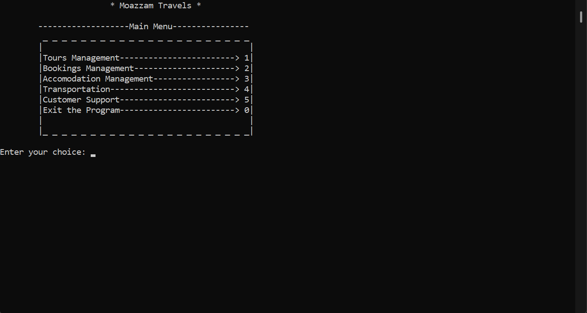
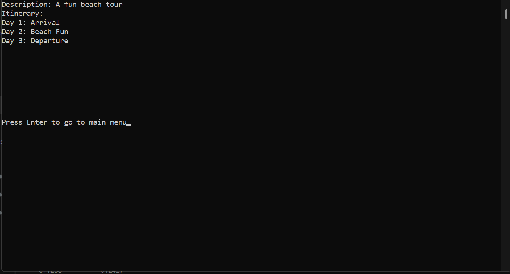
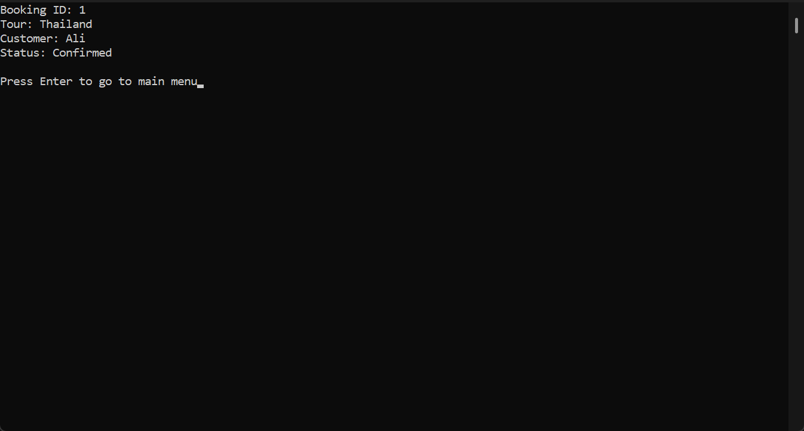
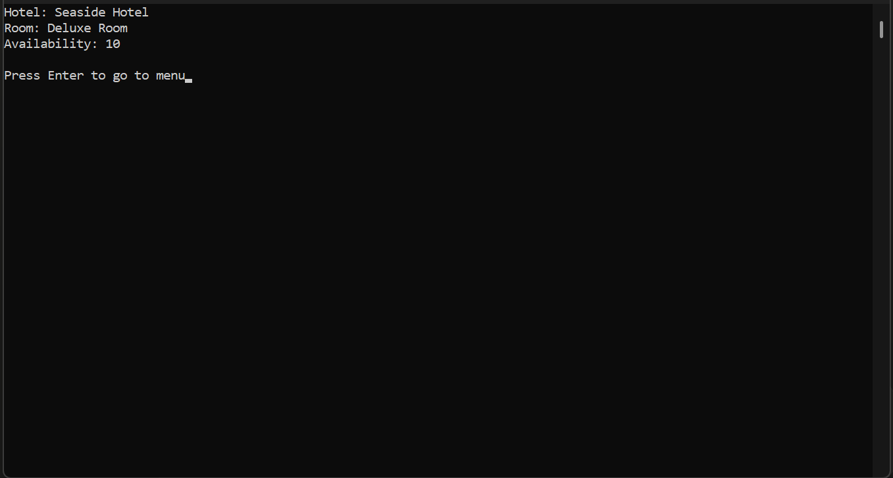
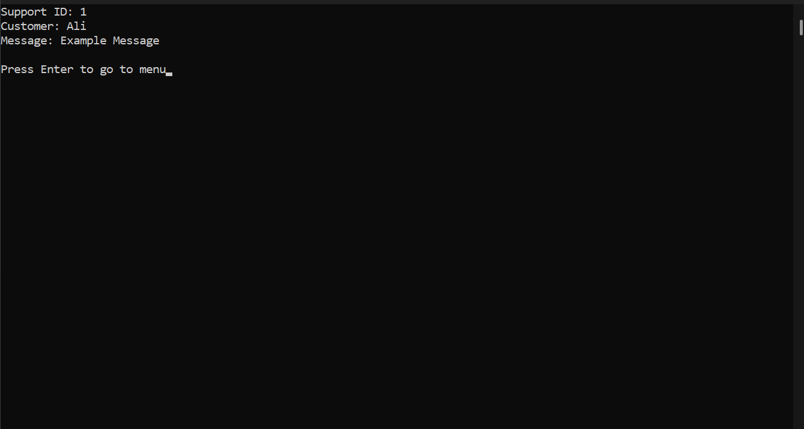

# 🧳 Tour Management System (C++)

A console-based application developed in C++ to simulate a complete tour and travel management system. The system allows users to manage tour packages, bookings, accommodations, transportation, and customer support through an interactive menu-driven interface.

---

## 🚀 Features

### 📦 Tour Package Management
- Add, view, customize, and delete tour packages
- Multi-day itinerary support

### 🧾 Booking System
- Create and view bookings
- Auto-generated booking IDs
- Customer tracking

### 🏨 Accommodation Management
- Add and view hotel details
- Room type and availability tracking

### 🚗 Transportation Management
- Add and view transportation options
- Manage travel details

### 🎧 Customer Support System
- Create and view support tickets
- Unique ticket IDs

### 🖥️ Menu-driven Interface
- Clean console navigation
- User-friendly interaction

---

## 🛠️ Tech Stack

- **Language:** C++
- **Concepts Used:** Arrays, Loops & Conditionals, String Handling, Basic Data Management

---

## ▶️ How to Run
```bash
# 1. Clone the repository
git clone https://github.com/MoazzamSharif/tour-management-system-cpp.git

# 2. Compile the code
g++ main.cpp -o project

# 3. Run the program
./project
```

---

## 📸 Screenshots

### Main Menu


### Tour Packages


### Booking System


### Accommodation


### Customer Support


---

## 📌 Limitations

- Uses static arrays (fixed size)
- No file handling (data is not saved permanently)
- No Object-Oriented Programming (OOP)

---

## 🚀 Future Improvements

- Convert to Object-Oriented Programming (OOP)
- Add File Handling or Database
- Build a GUI version (Qt / Web App)
- Add User Authentication System

---

## 👨‍💻 Author

**Moazzam Sharif** — Semester Project (PF Lab)
